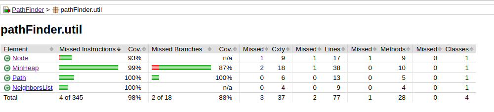

# Testausdokumentti

### Yksikkötestaus 

Luokille on tehty yksikkötestit JUnitilla (poislukien käyttöliittymästä vastaava UI-luokka).

Testikattavuutta seurataan Jacocolla. Testikattavuusraportti paketittain:

pathFinder-paketti:

util-paketti:

algorithms-paketti:

### Käyttöliittymän kautta testaaminen

Ohjelman toimintaa voi testata käyttöliittymän kautta. Käyttöliittymä kertoo kummallekin algoritmille löytyikö reitti, reitin pituuden sekä reitin etsintään kuluneen ajan. Löytynyttä reittiä sekä algoritmin vierailemia ruutuja voi tarkastella results-kansion pathAStar.txt ja pathIDA.txt tiedostoista. Käyttöliittymässä voi myös valita, mitä heuristiikkafunktiota algoritmi käyttää (uniform cost diagonal distance, diagonal distance vai Euclidean distance) ja funktion vaikutusta suoritusaikaan voi verrata.

Karttojen tulkitsiminen:

@	este

.	kulkukelpoinen

'#' 	reitti

'*'	vierailtu ruutu

### Suorituskykytestaus

Suorituskykytestauksessa testataan reitin löytymiseen kulunutta aikaa kahdella eri algoritmilla, A starilla ja IDA starilla. Toisessa vertailussa testataan, vaikuttaako suoritusaikaan valittu heuristiikkafunktio. Testaamiseen käytetään Moving AI Labin Berliinin karttaa, sekä siihen tehtyjä valmiita skenaarioita. 

Taulukossa 1 verrataan suoritusaikoja A-star- ja IDA-star-algoritmien välillä. Aikoina on käytetty kymmenen suorituskerran keskiarvoa. Molemmat löytävät lyhyimmän reitin lyhyemmillä reiteillä, mutta pidemmillä reiteillä IDA-starin suoritus kestää niin kauan, että ohjelma kaatuu. 

Sama kaaviona:

Testasin myös, onko valitulla heuristiikkafunktiolla vaikutusta suoritusaikoihin. Testasin tätä vain A-starilla. Tulokset taulukossa 2. Tämän pienen otoksen perusteella valitulla heuristiikkafunktiolla ei vaikuttaisi olevan suurta vaikutusta A-starin suoritusnopeuteen.

